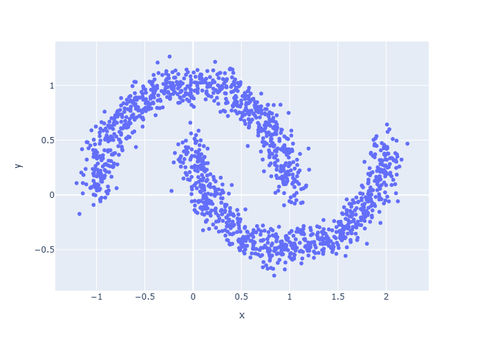
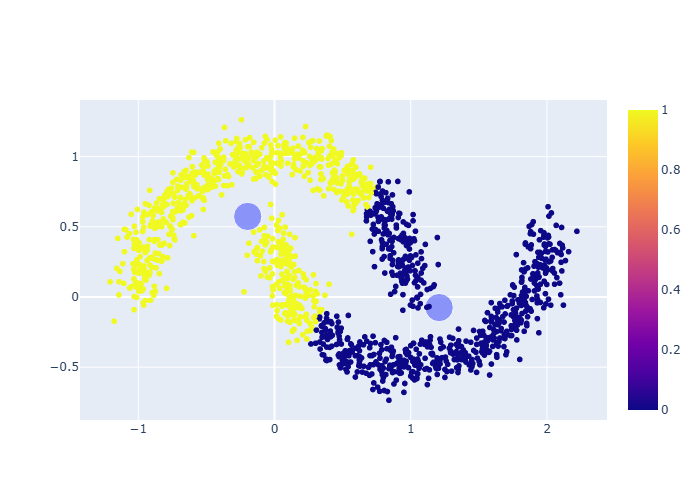
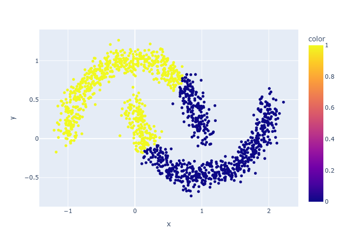
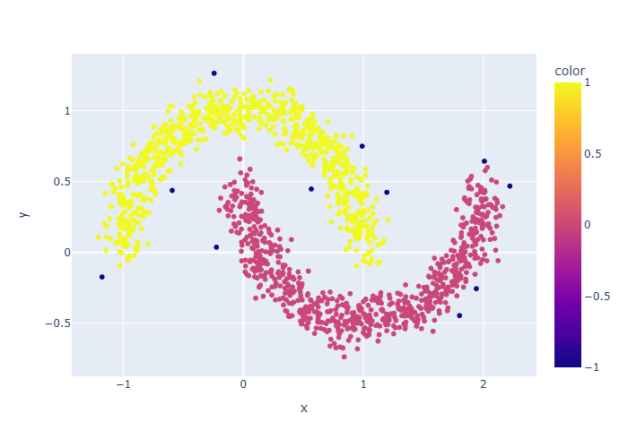

# 🌙 Clustering Inteligente com KMeans, DBSCAN e Hierárquico

> Um experimento visual e interativo com algoritmos de agrupamento usando dados não lineares em forma de lua 🌕

---

### 🔍 Visão Geral

Neste projeto, exploramos o poder dos algoritmos de **agrupamento (clustering)** aplicados a dados não triviais. Usamos o conjunto **`make_moons`** do `scikit-learn`, ideal para testar modelos em situações onde formas não esféricas e a presença de ruído desafiam técnicas tradicionais.

🎯 **Objetivo:** Comparar visualmente os resultados dos modelos de clustering, **KMeans**, **DBSCAN** e **Agglomerative Clustering**, e entender suas características, vantagens e limitações na identificação de padrões complexos.

---

### 🚀 Algoritmos Utilizados

| Algoritmo               | Tipo                      | Destaques                                                                 |
|-------------------------|---------------------------|--------------------------------------------------------------------------|
| `KMeans`                | Particional               | Simples e eficiente, mas sensível a formas não circulares e outliers.    |
| `AgglomerativeClustering` | Hierárquico            | Cria hierarquias naturais de agrupamentos, bom para estruturas aninhadas. |
| `DBSCAN`                | Densidade (Density-Based) | Excelente com formas arbitrárias, detecção de outliers e clusters de densidade variável. |

---

### 📊 Resultados Visuais: A Jornada dos Agrupamentos

Acompanhe a transformação dos nossos dados "lua" à medida que cada algoritmo tenta desvendar sua estrutura interna. Para uma experiência completa, **clique nas imagens** para explorar os gráficos interativos!

#### 🌑 O Desafio: Nossos Dados Originais
O ponto de partida: como os dados se apresentam, com as duas "luas" entrelaçadas e o ruído.

[](original_dataset_moon.html)

---

#### ✨ A Busca por Centros: K-Means em Ação
O K-Means tenta dividir os dados em 2 grupos baseando-se em seus centroides. Observe sua dificuldade em lidar com formas não-esféricas.

[](kmeans_clusters_and_centroids.html)

---

#### 🌳 A Construção de Hierarquias: Agglomerative Clustering
Este método hierárquico agrupa os pontos passo a passo, formando clusters com base na proximidade.

[](agglomerative_clusters.html)

---

#### 🌌 Encontrando Densidades e Ruídos: O Poder do DBSCAN
O DBSCAN se destaca por identificar clusters de diferentes formas e densidades, além de conseguir isolar o ruído (pontos em cinza/roxo). Para o dataset `make_moons`, ele geralmente revela a estrutura real com maestria.

[](dbscan_clusters.html)

---

### 🧠 Aprendizados Esperados

- Compreensão das **diferenças fundamentais** entre agrupamentos particionais, hierárquicos e baseados em densidade.
- **Visualização clara** de como diferentes modelos lidam com a complexidade de dados não lineares e com ruído.
- Critérios para **escolher o algoritmo** mais adequado com base na forma e densidade dos seus dados.

---

### 📦 Instalação

Para rodar este projeto localmente, siga estes passos:

1.  Clone o repositório:

    ```bash
    git clone [https://github.com/seu-usuario/seu-repositorio.git](https://github.com/seu-usuario/seu-repositorio.git)
    cd seu-repositorio
    ```

2.  Instale as dependências. Certifique-se de que o `kaleido` esteja incluído para salvar os gráficos como imagem:

    ```bash
    pip install -r requirements.txt
    ```
    (Crie um arquivo `requirements.txt` com: `pandas`, `numpy`, `scikit-learn`, `plotly`, `kaleido`)

3.  Execute o notebook Jupyter para gerar os gráficos e os resultados:

    ```bash
    jupyter notebook clustering_algorithms.ipynb
    ```

---

### 🧰 Tecnologias & Bibliotecas

[](https://www.python.org/)
[](https://scikit-learn.org/)
[](https://plotly.com/python/)
[](https://numpy.org/)
[](https://pandas.pydata.org/)
[](https://jupyter.org/)
[](https://scikit-learn.org/stable/modules/clustering.html#k-means)
[](https://scikit-learn.org/stable/modules/clustering.html#dbscan)
[](https://scikit-learn.org/stable/modules/clustering.html#hierarchical-clustering)

---

### 👨‍💻 Autor

**Daniel Coelho**  
💼 [LinkedIn](https://www.linkedin.com/in/daniel-coelho-818381293/) • 💻 [GitHub](https://github.com/danccoelho)  

---

### 🌟 Contribua!

Se você curtiu o projeto, deixe uma ⭐ no repositório e contribua com novas ideias ou melhorias!

---